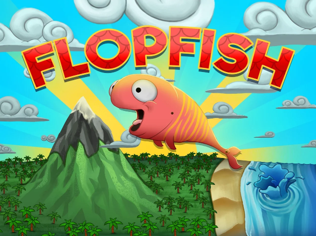
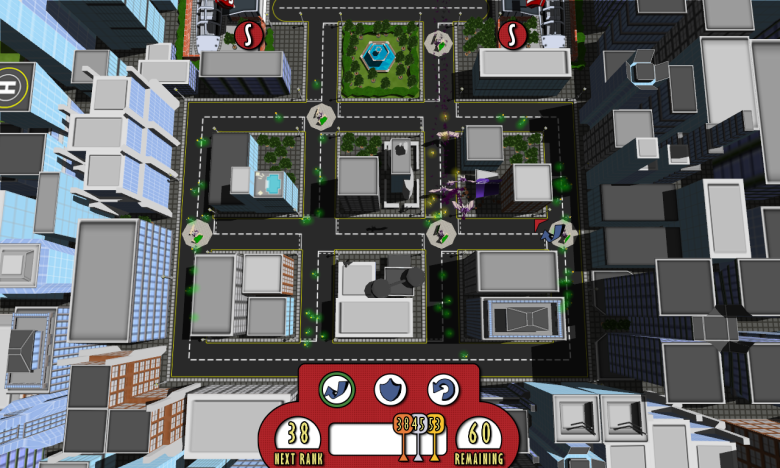
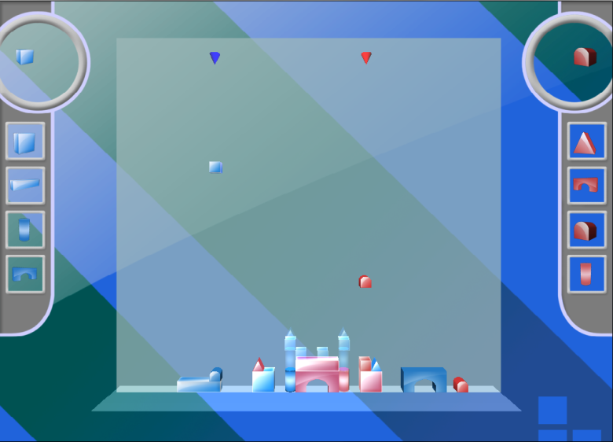

# Websites

## Client Website

Local Brisbane Tanning Business

[Bronze Bar](https://bronze-bar.com.au/)

# Games

## Flop Fish

Flop your fish on the greatest adventure yet! Collect gems, avoid the sea, battle pirates and don’t be eaten in the craziest flop around.

Developed by Tannlark Studios a company co-founded by myself and David Trafford.

## Deathbeast

You are the bad guy and control a horde of deathbeasts which you can use to
scare, herd and capture unsuspecting humans and enslave them.

Deathbeast was the result of a 24 week project made by 5 people. My role on this project was Project manager and Designer as well as taking care of putting the audio together.

### Features
- 13 levels
- 3 special abilities to unlock
- Humans to scare
- Set down traps to capture them
- 48 variations in decorative assets

## Block Head

2 player block building game in the style of tetris. Players are given the template of a structure and must work together by using the blocks to complete each structure.

Block Head was the result of a 2 week rapid prototyping challenge made by 2 people. My role on this project was Designer and Programmer.

### Features
- 2-player Co-Op
- Freeplay mode
- 15 levels
- 5 variations in Background art

